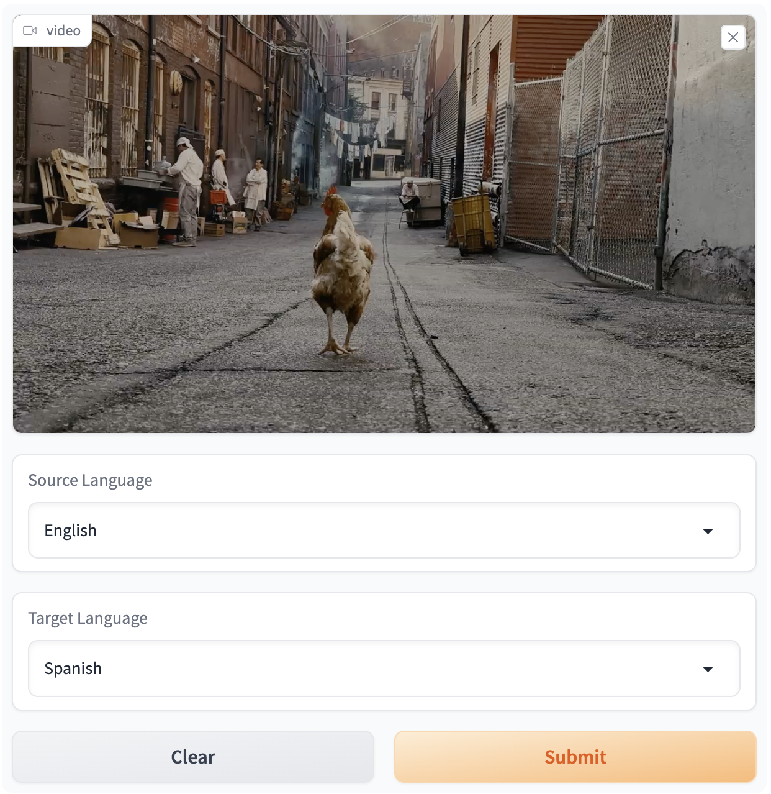
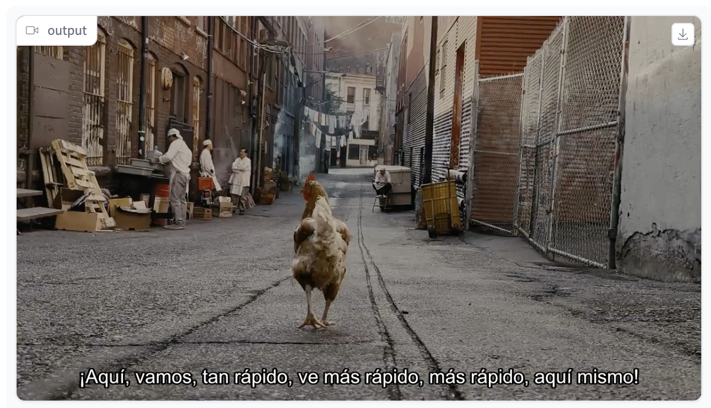
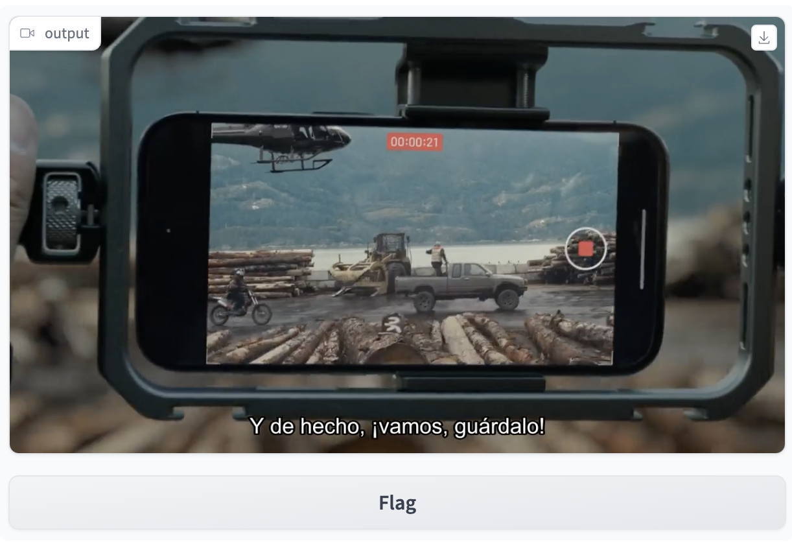

# Video Subtitler 🍿
Adding Subtitles to Your Videos Made Easy 🎉


## Overview

The demand for multilingual subtitling has significantly increased with the growth of online video platforms and global communication. It is an essential part of video production that allows hearing-impaired viewers and people who speak different languages to enjoy and comprehend video content.

To address this need, the video-subtitler project is available on GitHub as an open-source Python project. The project utilizes powerful libraries such as ffmpeg and openAI whisper to handle various video formats and recognize text in different languages.

This repository provides an automated solution for generating subtitles in multiple languages for videos. It includes an interactive interface using Gradio, allowing users to input a video file and select the source and target languages for the subtitles.
## Installation

1. Clone this repository using `git clone https://github.com/KarinBrisker/video-subtitler.git`
2. Install the required packages using `pip install -r requirements.txt`


## Usage

The video-subtitler project provides a command-line interface for adding subtitles to videos in multiple languages. To use the project, you will need to have a video file and a text file containing the subtitles in the target languages. The following command will add subtitles to a video:

```
python main.py <path_to_video> --output_dir <output_directory> --input_language <input_language> --output_language <output_language>
```

Make sure to replace `<path_to_video>` with the actual path to your video file, `<output_directory>` with the directory where you want to save the output file, `<input_language>` with the code of the language spoken in the video (or leave it blank for language detection), and `<output_language>` with the code of the language for the subtitles.

For example, if you have saved your video file as `myvideo.mp4` in the same directory as your Python file, and you want to generate Spanish subtitles for it, you can use the following command:
```
python main.py myvideo.mp4 --output_dir output --input_language English --output_language Spanish
```

## Demo
You can try out a demo of the video subtitler [here!](https://huggingface.co/spaces/Kabriske/Multilingual_Video_Subtitler)


[](https://huggingface.co/spaces/Kabriske/Multilingual_Video_Subtitler)    







## Acknowledgements
- [ffmpeg](https://ffmpeg.org/)
- [Google Cloud Translate API](https://cloud.google.com/translate)
- [Whisper](https://openai.com/research/whisper)
- [Gradio](https://gradio.app/)

## Contributing
Contributions to this repository are welcome! 😇 

If you find a bug or have a feature request, please open an issue on the repository or submit a pull request.


## License

This project is licensed under the  [MIT License](https://choosealicense.com/licenses/mit/)
